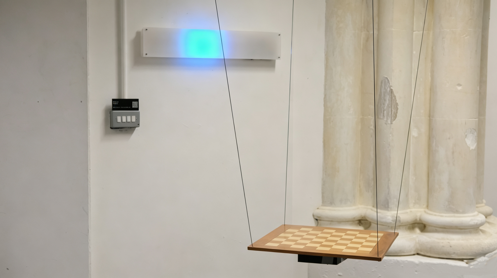
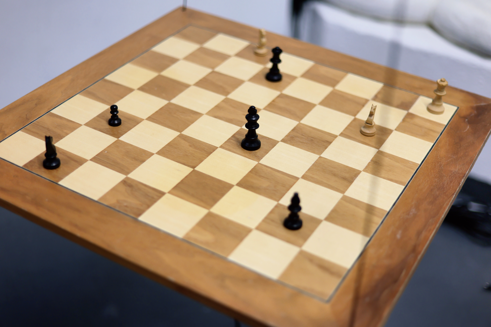
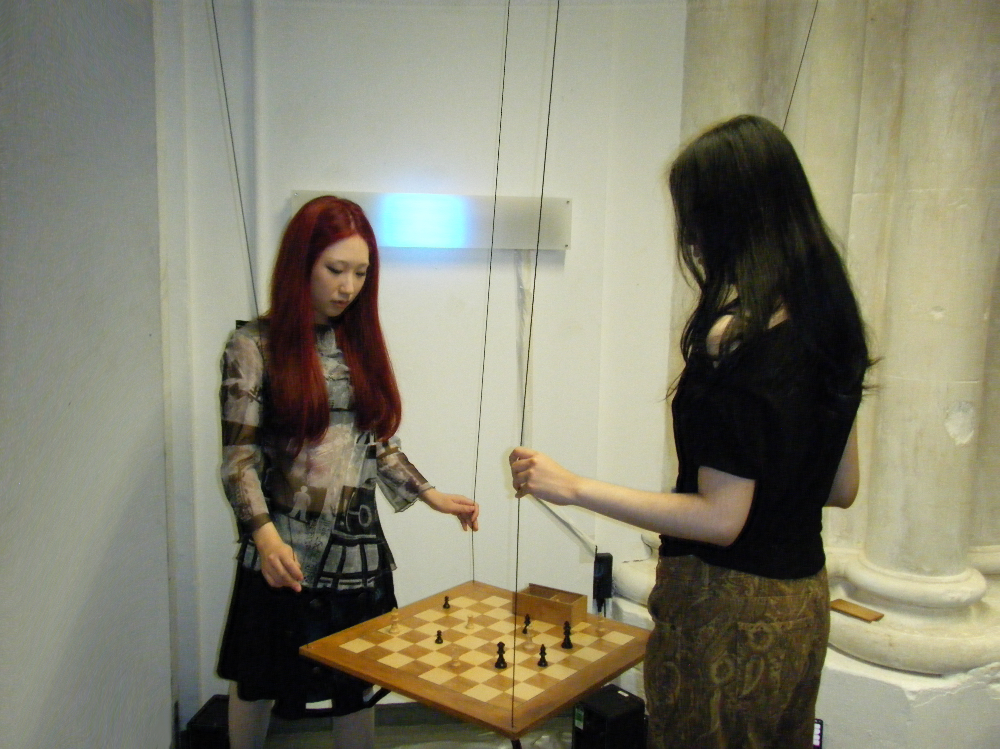

# Chorus

*An interactive installation that explores the layered nature of inner thoughts through movement, sound and light.*

By Kechun Wang — Computational Arts, Goldsmiths, University of London

**Video:** https://vimeo.com/1223816517?fl=ip&fe=ec



## Description

Chorus is an interactive installation that explores the layered nature of inner thoughts through movement, sound and light.

## Concept: why a chessboard



The work takes the form of a grid-like chessboard as its main interactive interface. The grid represents a sense of order, similar to the way we try to organise and control our thoughts. The chessboard also reflects the contrast between a simple external action and a complex internal process. When someone plays chess, what others see may be just a single move, but before that move is made, the player may already be imagining different routes, choices and possible outcomes in their mind. Behind one seemingly definite action, multiple lines of thought can exist at the same time. This reflects the idea behind Chorus: while there may be only one physical action on the surface, multiple inner voices can exist simultaneously.

## Interaction



When the audience gently pushes the board, its balance is disturbed, triggering changes in sound and LED light. Different layers of sound begin to overlap and interact, like multiple thoughts appearing in the mind at the same time. Through this process, the work moves between order and disorder, control and loss of control.

## Technical implementation

An MPU6050 sensor mounted on the suspended board detects its movement and sends the data to Max/MSP, where it controls the transitions between different layers of sound.

- **Sensing** — A Raspberry Pi Pico W fitted with the MPU6050 IMU (`File for code/pico_mpu6050_ide.ino`) reads acceleration and gyroscope data at ~40 Hz and streams it as OSC (`/accel ax ay az`, `/gyro gx gy gz`) over Wi-Fi/UDP to a computer running Max/MSP.
- **Sound** — `File for code/Final.maxpat` receives that OSC stream on port 8000 and extracts motion features from the raw accelerometer/gyroscope signal to control the sound layers. The initial design included four sound layers, but during testing the sensitivity of the sensor made some interactions difficult to control consistently, so the final version uses two overlapping sound layers instead. This keeps a sense of overlap, conflict and unpredictability, while making the relationship between the audience's movement and the sound response clearer.
- **Light** — `File for code/gyro_to_led.maxpat` listens to the same accelerometer stream and maps it to colour and position (X → position along the strip, Y → green, Z → blue), sending `/led/pos` and `/led/color` OSC messages to a second Pico W (`File for code/pico_led_wifi.ino`) that drives a 41-pixel NeoPixel strip, producing a moving, glowing segment that echoes the board's motion.

## Reflection

Chorus does not try to fully visualise or explain our thoughts. Instead, it transforms this layered and constantly changing inner state into an experience that can be felt through the body. The audience tries to control the board, but each movement also creates a new disturbance. For me, interaction is not simply a tool for triggering sound and light; it becomes part of the emotional expression of the work itself.

## Folder contents

```
Final submit/
├── README.md
├── Chorus_Final_Proposal.pdf / .docx      (original artwork proposal)
├── Summer Final Project Submission Guide.docx
├── chorus photo/
│   ├── 1.JPG                               — cover / installation view
│   ├── 2.JPG                               — visitors interacting with the board
│   ├── 3.JPG                               — detail of the chessboard surface
│   ├── Chorus.mp4                          — documentation video
│   └── Video.pdf                           — link to the hosted video
└── File for code/
    ├── Final.maxpat                        — main Max/MSP patch: OSC input, motion feature extraction, sound layers, audio output
    ├── gyro_to_led.maxpat                  — bridges accelerometer data to LED strip OSC commands
    ├── pico_mpu6050_ide.ino                — firmware for the sensor Pico W (MPU6050 → Wi-Fi → OSC)
    └── pico_led_wifi.ino                   — firmware for the LED Pico W (OSC → Wi-Fi → NeoPixel strip)
```

## Hardware

- **Sensor unit:** Raspberry Pi Pico W + MPU6050 IMU. Wiring: `VCC → 3V3`, `GND → GND`, `SCL → GP5`, `SDA → GP4`. Mounted on the board to sense its push/pull/shake motion.
- **Light unit:** Raspberry Pi Pico W + WS2812/NeoPixel strip (41 LEDs), data pin `GP16`.
- Both boards communicate with the show computer over a local Wi-Fi network using OSC over UDP.

## Running it

1. Flash `pico_mpu6050_ide.ino` to the sensor Pico W. Update the Wi-Fi credentials and set `host` to the IP address of the computer running Max/MSP — the board sends OSC to that address on port 8000.
2. Flash `pico_led_wifi.ino` to the LED Pico W. It joins the same Wi-Fi network and listens for OSC on port 9000.
3. Open `Final.maxpat` in Max/MSP (9.0.9 or later) and run it — it listens on port 8000 for `/accel` and `/gyro` and crossfades between the two sound layers based on the board's motion.
4. Open `gyro_to_led.maxpat` and set the `udpsend` target to the LED Pico W's IP address (update the object currently pointing at `192.168.8.174 9000`), so position/colour data reaches the LED strip.
5. Gently push or set the board swinging — the installation responds in sound and light, then slowly settles back toward stillness.

> **Note:** the Wi-Fi credentials and IP addresses hard-coded in the `.ino` sketches and `.maxpat` patches belong to the exhibition network used for the degree show. Replace them with your own network's details before reusing this code elsewhere.

## Credits

Kechun Wang, MA/MFA Computational Arts, Goldsmiths, University of London.

